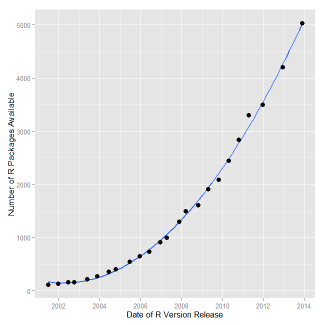

# Introduction to R {#introR}


```{r include=FALSE}
library(ggplot2)
library(dplyr)
library(knitr)
library(xtable)
library(gridExtra)
opts_chunk$set(echo=FALSE, warning=FALSE, message=FALSE)
```


```{r}
include_graphics(c("01files/jchambers.jpg","01files/small-ihaka.gif","01files/small-robert.gif"))
```

R is a programming language and an environment for statistical computing and graphics. It was created by Ross Ihaka and Robert Gentleman at the University of Auckland in New Zealand. The project was conceived in 1992. It is based on the **S** language, that was created by John Chambers while he was at Bell Labs. S is now owned by TIBCO. R and S are often called "elegant" for they were created by statisticians for statisticians.

The website of the R-Project is: [http://www.r-project.org](http://www.r-project.org)


```{r}
include_graphics("01files/Rlogo.png")
```

## Why use R?

There are many benefits to R. Since these have been covered by many other books on R, I will not dwell on it here in detail. Here are 9 reasons why I use R.

1. R is available as a free and open source software. As such, there is no need to reinvent the wheel by writing code for tasks for which functions have already been written. The availability of open source code also means that one can tinker with the software without any limitations presented by proprietary software.
2. The reproducibility of analysis is greatly enhanced in **R** because it is script-based. In software that uses point-and-click mechanisms in graphical user interfaces to perform operations (without any corresponding code generation), the ability to reproduce an analysis requires one to either memorize or record the analysis process.
3. New routines generally appear in **R** before any other statistical system introduces them.

```{r}

```

Source: [Muenchen, Robert A, The Popularity of Data Analysis Software.](http://r4stats.com/articles/popularity/), Retrieved 8/15/2013

4. Graphics that are produced by **R** can be mindblowing. It is not a surprise that many reputable news outlets that rely on data graphics to communicate stories use R. The **ggplot2** package, in particular, has become the gold standard for creating publication-quality visualizations.
5. The **R** environment uses the Internet for distributing packages and any updates to R can be downloaded from the web. Thus, there is no need for software media.
6. The software is compatible with many operating systems --- Unix, Mac OSX, and Windows.
7. It supports connectivity with many database systems and allows for import of data from different formats.
8. You wouldn't want to not use the software that was featured in a cool [New York Times story by Ashlee Vance.](http://www.nytimes.com/2009/01/07/technology/business-computing/07program.html)
9. Although I have listed this point at the very end of this list, it is probably the number one reason for my using the software. The community support for **R** users is simply outstanding. The global user-base for the software is 250,000--2 million people and many of these users selflessly devote their time to support and assist other users. The pay-it-forward mechanism holds so true for many in the user-base.

Although R provides a command line interface for programming, which can be a limitation for people who are starting out in it, there are integrated development environments from companies like RStudio (now Posit) and Revolution Analytics (now with Microsoft) that make an R-user more productive. In particular, the **RStudio IDE** has become the de facto environment for R programming, offering a rich set of features for code editing, debugging, package management, and R Markdown authoring.


Robert Muenchen has been tracking the popularity of data analysis software for a few years and he has an excellent article that is regularly updated with the latest statistics that compare the growth of R versus other software like SPSS and SAS. His article can be accessed from [http://r4stats.com/articles/popularity/](http://r4stats.com/articles/popularity/).


R packages that help users accomplish different tasks can be found for many fields of study. The listing from the R-project site at [CRAN Task Views](https://cran.r-project.org/web/views/) provides a broad listing of the different fields that have been supported. Please note that many developmental versions of packages are not listed. These are typically hosted at other websites, such as [GitHub](https://www.github.com).


## R - Environment and Software

I like to understand this using the metaphor of a physical library. Imagine walking into such a library. (Okay, I know that these are becoming extinct, thanks to ebooks like this one.) When we walk into this library, you are able to accomplish some tasks by talking to the librarian, who refers to the books s/he has access to at the desk. For tasks that the librarian is unable to help with, you check-out a book that helps you with the tasks that you were trying to accomplish. If you are unable to find a book that helps with your task, you decide to sit down and write your own book to perform those tasks.

Base **R** is akin to the library and the librarian. A task in the earlier example can be similar to an analysis that needs to be conducted on some data. The **R** software comes with a certain set of books, which are called *packages*. These packages are capable of conducting a certain set of analyses. However, when the need to perform additional analyses that cannot be conducted by base **R** arises, one can download additional **R** packages that may be available for that purpose. These downloaded packages are like the books that are checked out from the library. Please note that many a times, the packages may have dependencies, that are either installed along with the package installation commands, or may have to be installed separately. In the event no one in the world has thought of your problem and written a package to perform the analysis, you can always write your own package that does that and contribute it for the greater good.

## The Tidyverse

One of the most important developments in the R ecosystem has been the creation of the **tidyverse** --- a collection of R packages designed for data science that share a common design philosophy, grammar, and data structures. The tidyverse was primarily created by Hadley Wickham and is maintained by the team at Posit (formerly RStudio).

The core tidyverse packages include:

- **ggplot2**: A system for creating graphics based on the Grammar of Graphics
- **dplyr**: A grammar of data manipulation
- **tidyr**: Tools for creating tidy data
- **readr**: Fast and friendly reading of rectangular data (CSV, TSV, etc.)
- **purrr**: Functional programming tools
- **tibble**: A modern reimagining of the data frame
- **stringr**: Consistent tools for working with strings
- **forcats**: Tools for working with categorical variables (factors)

You can install the entire tidyverse with a single command:

```{r eval=FALSE, echo=TRUE}
install.packages("tidyverse")
```

And load it with:

```{r eval=FALSE, echo=TRUE}
library(tidyverse)
```

Throughout this book, we will use both base R and tidyverse approaches. The tidyverse is covered in depth in Chapters \@ref(tidyverse) through \@ref(purrr). For the companion data visualization course, see [Visual Analytics and Data Storytelling](http://patilv.com/VizAnalytics4Biz/).


## A Recently Released Video on R

From the [R Consortium](https://www.r-consortium.org/) <br>
<center>
<iframe width="560" height="315" src="https://www.youtube.com/embed/XcBLEVknqvY" frameborder="0" allowfullscreen></iframe>


