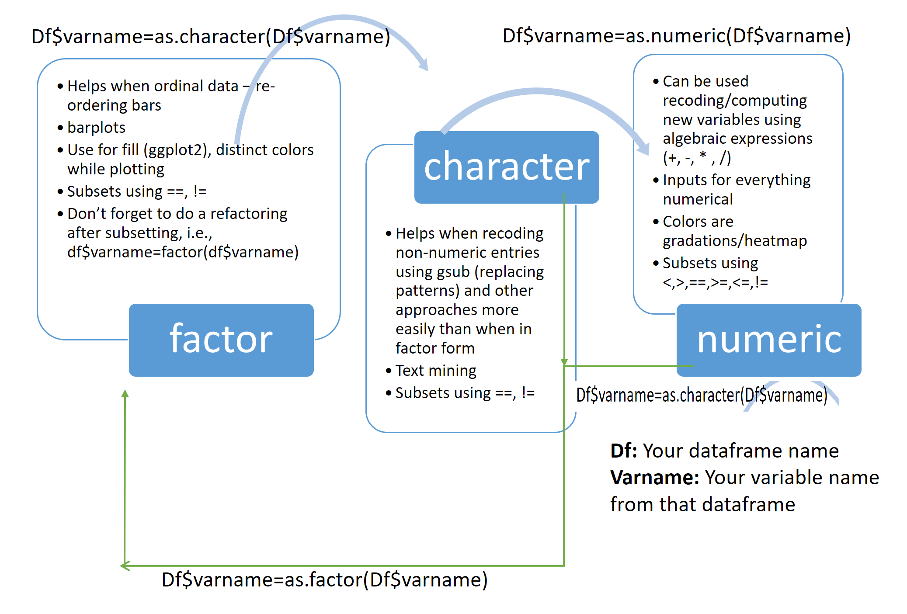

# Modifying Data {#modifydata}

Let's be honest: real-world data is a disaster. Customer databases have typos from that one intern who thought "N/A" and "NA" and "none" were interchangeable. Survey exports arrive with column names that look like someone fell asleep on the keyboard. And there is always --- always --- a text field hiding in what should be a numeric column. Welcome to data wrangling, the unglamorous but absolutely essential skill that separates the analyst who gets answers from the one who gets error messages.

This chapter teaches you how to reshape, clean, and wrestle your data into submission using both base R and tidyverse approaches. Think of base R as the dependable Honda Civic your parents drove for fifteen years --- nothing fancy, but it never broke down. The tidyverse is the Tesla --- sleeker interface, better user experience, and everyone at the office wants to talk about it. Both get you to work on time; it is mostly a matter of preference and how much you enjoy reading your own code six months from now. For the full dplyr deep-dive, see Chapter \@ref(dplyr).

## Creating new variables

### Base R approach

In business, you constantly need variables that do not exist yet in your raw data. Total revenue? That is price times quantity, and no database on Earth ships with that pre-calculated (wouldn't that be nice). Customer lifetime value? A combination of purchase frequency, average order size, and tenure. The point is, you will spend a surprising chunk of your career creating new columns.

In base R, you create new columns by assigning directly to the data frame using the `$` operator. It is like adding a new column to a spreadsheet, except you get to feel smarter about it.

For example, if we wanted to create a variable in the `iris` dataset that was a sum of `Sepal.Length` and `Sepal.Width` and call it `Sepal.dimensions`:

```{r eval=FALSE}
iris$Sepal.dimensions <- iris$Sepal.Length + iris$Sepal.Width
```

There might be times when you want to overwrite an existing variable instead of creating a new one. Maybe you realized your revenue column forgot to include tax. In that case, just use the same variable name on the left side. Fair warning though --- there is no undo button. This is not Google Docs. Once you overwrite it, it is gone.

```{r eval=FALSE}
iris$Sepal.Length <- iris$Sepal.Length + iris$Sepal.Width
```

### Tidyverse approach (dplyr)

The `mutate()` function from **dplyr** provides a cleaner way to create new variables. The big win here is readability --- you do not have to keep typing the data frame name over and over like you are being charged per keystroke.

```{r eval=FALSE}
library(dplyr)
iris <- iris %>%
  mutate(Sepal.dimensions = Sepal.Length + Sepal.Width)
```

Note how `mutate()` does not require you to repeat the data frame name for each variable --- just use column names directly. Your future self will thank you when reviewing old code at 11 PM the night before a deliverable.


## Subsetting data and dropping factor levels

Subsetting is basically filtering out the noise so you can focus on what matters. You have a database with 500,000 customer records and your boss only wants to see the ones who spent more than $100 last quarter. Or maybe you are analyzing survey responses but only from respondents in the Southeast region. Or perhaps you need last quarter's transactions and nothing else. Whatever the reason, subsetting is the data equivalent of saying "I only want to talk to these people."

### Base R approach

This creates a subset of `iris` such that `Sepal.Length` is greater than or equal to 5.8. Think of it as pulling only the VIP customers from your database --- the ones above a certain spending threshold.


```{r include=FALSE}
library(dplyr)
opts_chunk$set(echo=TRUE, warning=FALSE, message=FALSE)
```


```{r}
irisSubset1 <- iris[iris$Sepal.Length >= 5.8,]
summary(irisSubset1$Sepal.Length)
```

You can also stack multiple conditions. Want customers who are both high-spending AND from the Northeast? Same idea --- just combine your filters with `&`:

```{r}
irisSubset2 <- iris[iris$Sepal.Length >= 5.8 & iris$Sepal.Width < 3,]
summary(irisSubset2)
```

Subsetting based on a factor variable works a bit differently. The following line of code creates a subset of the `iris` dataset that has only two types of Species --- like filtering your CRM to show only "Enterprise" and "Mid-Market" clients while ignoring the "Small Business" segment.

```{r}
irisSubset3 <- subset(iris, Species %in% c("setosa", "versicolor"))
# This can also be accomplished by the following statement
# irisSubset3 <- iris[iris$Species != "virginica",]
```

### Tidyverse approach (dplyr)

Here is the modern approach. The `filter()` function from **dplyr** reads almost like plain English, which is a lifesaver when you come back to your code six months later and cannot remember why you wrote `iris[iris$Sepal.Length >= 5.8,]`. (Past-you thought it was obvious. Present-you disagrees.)

```{r}
irisSubset1_tidy <- iris %>% filter(Sepal.Length >= 5.8)
summary(irisSubset1_tidy$Sepal.Length)
```

```{r}
irisSubset2_tidy <- iris %>% filter(Sepal.Length >= 5.8, Sepal.Width < 3)
summary(irisSubset2_tidy)
```

```{r}
irisSubset3_tidy <- iris %>% filter(Species %in% c("setosa", "versicolor"))
```

Let us verify that we indeed have only two levels of the `Species` variable.

```{r}
summary(irisSubset3$Species)
```

Here is a fun little gotcha that will trip you up at least once (consider it a rite of passage): even though we excluded `virginica`, R still remembers it existed as a factor level --- it just shows 0 observations. It is like removing a department from your company but the name still shows up in the HR dropdown menu. Nobody works there anymore, but the system insists it is still an option. To clean that up, we re-factor:

```{r}
irisSubset3$Species=factor(irisSubset3$Species)
```

Let us verify that did the trick.

```{r}
summary(irisSubset3$Species)
```


## Reordering factor levels

### Base R approach

By default, R orders factor levels alphabetically. That is fine until you realize your customer satisfaction survey goes "Dissatisfied, Neutral, Satisfied, Very Dissatisfied, Very Satisfied" --- which is alphabetical nonsense. You need it to flow logically, from "Very Dissatisfied" to "Very Satisfied," because that is how human brains (and your manager) expect to read it. Here is how you take control.

```{r}
levels(iris$Species)
```

The default sequence is `setosa`, `versicolor`, and `virginica`. Let us reverse it --- because sometimes you want the premium tier listed first. (Think of how luxury brands always list their most expensive product at the top.)

```{r}
iris$Species <- factor(iris$Species, levels(iris$Species)[c(3, 2, 1)])
```

By specifying the sequence, the earlier third level now becomes the first, the second stays put, and the old first level moves to third. Let us verify:

```{r}
levels(iris$Species)
```

### Tidyverse approach (forcats)

The **forcats** package (Chapter \@ref(forcats)) makes reordering factor levels feel less like solving a Rubik's Cube blindfolded. The function names actually tell you what they do, which is a refreshing change from base R's "guess what this bracket notation means" approach.

```{r}
library(forcats)
# Reverse the levels
iris$Species <- fct_rev(iris$Species)
levels(iris$Species)
```

```{r}
# Set specific order
iris$Species <- fct_relevel(iris$Species, "setosa", "versicolor", "virginica")
levels(iris$Species)
```

## Reordering dataset entries

### Base R approach

Sorting data is one of those things you will do approximately fourteen times a day. Maybe you want your sales reps ranked from highest revenue to lowest so you can see who is crushing it (and who needs a pep talk). Maybe you want survey responses sorted by completion time. The `order` function is your friend here, even if its syntax looks like it was designed by someone who wanted to keep a secret.

For example, the `Sepal.Length` of the first row of the `iris` dataset:

```{r}
iris$Sepal.Length[1]
```

And the range of the variable:

```{r}
range(iris$Sepal.Length)
```

Sorting in ascending order (smallest to largest --- think ranking your sales team from the newest hire to the top closer):

```{r}
ascendingiris <- iris[order(iris$Sepal.Length),]
head(ascendingiris$Sepal.Length)
```

And descending order --- the "show me the leaderboard" view:

```{r}
descendingiris <- iris[order(-iris$Sepal.Length),]
head(descendingiris$Sepal.Length)
```

### Tidyverse approach (dplyr)

The `arrange()` function is so much more readable that it almost feels like cheating. You can practically read it as a sentence: "take this data and arrange it by this column." Your code reviews will be a breeze.

```{r}
ascendingiris_tidy <- iris %>% arrange(Sepal.Length)
head(ascendingiris_tidy$Sepal.Length)
```

```{r}
descendingiris_tidy <- iris %>% arrange(desc(Sepal.Length))
head(descendingiris_tidy$Sepal.Length)
```


## Changing column names

Let us talk about one of the most underrated quality-of-life improvements in data analysis: giving your columns names that a human being can actually understand. Maybe your data arrived from a legacy database with column names like `X_VAR_007_Q3_FINAL_v2` or some brave soul used spaces and emojis. (Yes, this happens.) Renaming columns is a small investment that pays enormous dividends every time you or anyone else has to read the code.

### Base R approach

Current names of columns in dataset:

```{r}
names(irisSubset3)
```

Rename the `Species` column:

```{r}
names(irisSubset3)[5] <- "SpeciesWithoutvirginica"
names(irisSubset3)
```


```{r eval=FALSE}
names(dataname) <- c("newcol1", "newcol2", "newcol3") # for a 3 column dataset
names(dataname)[3] <- "latestcol3name" # changing name for only the third column
```

### Tidyverse approach (dplyr)

The `rename()` function from **dplyr** uses a `new_name = old_name` syntax, which reads more naturally --- like you are telling R "hey, this column used to be called this, now call it that":

```{r eval=FALSE}
dataname <- dataname %>% rename(newnamecol1 = oldnamecol1, newnamecol2 = oldnamecol2)
```

Use `rename_with()` to apply a function to column names --- great for bulk cleanup when every column name is SCREAMING AT YOU IN ALL CAPS:

```{r eval=FALSE}
# Make all column names lowercase
dataname <- dataname %>% rename_with(tolower)
```


## Renaming/Collapsing factor levels

Sometimes the categories in your data need a rebrand. Maybe the marketing team decided "Premium Tier" sounds better than "Segment C," or maybe you have seventeen product subcategories and your presentation has room for four. Renaming and collapsing factor levels is the data equivalent of reorganizing your company's org chart --- same people, different labels.

Let us make a copy of the iris dataset to experiment with (always a good idea --- never experiment on production data, kids):

```{r}
playiris=iris
levels(playiris$Species)
```

Pay attention to the order of the factor levels --- it matters for what comes next. We will change `virginica` to `factor3` and `versicolor` to `factor2` using two different approaches.

First approach --- match by name. This is the safer method because you are being explicit about which label you are changing. It is like addressing a memo to a specific person rather than "whoever is sitting in the third chair":

```{r}
levels(playiris$Species)[levels(playiris$Species)=="virginica"]="factor3"
levels(playiris$Species)
```

Second approach --- match by position. This works but is riskier because if your factor levels ever change order (and they will, Murphy's Law guarantees it), you will rename the wrong category. It is like reorganizing your filing cabinet by number instead of name --- efficient until someone shuffles the folders.

```{r}
levels(playiris$Species)[2]="factor2"
levels(playiris$Species)
```

You can also rename all levels at once if you are feeling bold (or have had enough coffee):

```{r}
levels(playiris$Species)=c("newlevel1","newlevel2","newlevel3")
levels(playiris$Species)
```

## Converting data types

OK, this section is the broccoli of the chapter --- not the most exciting, but absolutely essential for your health as a data analyst. Getting your data types right is non-negotiable because roughly half the errors you will encounter in R boil down to R thinking a variable is one type when you expected another. Spending five minutes here will save you hours of staring at cryptic error messages and questioning your career choices.

### Factor to numeric

This comes in handy when you have a factor variable with numbers as values and you want to treat it as a numeric variable. Imagine a customer satisfaction survey where ratings (1 through 5) got imported as categories instead of numbers. R sees "1" and "5" as labels, not quantities --- like seeing jersey numbers on a basketball team. The number 23 does not mean that player is "more" than player 7. This discussion is [based on this Stack Overflow post.](http://stackoverflow.com/questions/3418128/how-to-convert-a-factor-to-an-integer-numeric-without-a-loss-of-information)

Let us go back to the `playiris` dataset. Remember the factor levels?

```{r}
levels(playiris$Species)
```

If we summarize the variable, it gives us the number of observations per level --- a head count, not a statistical summary:

```{r}
summary(playiris$Species)
```

Let us convert the level labels to numbers:

```{r}
levels(playiris$Species)=c("1","2","3")
summary(playiris$Species)
```

Here is the sneaky part. Even though the labels look like numbers now, R is still treating them as categories. It is still counting how many observations fall in each bucket instead of computing a mean. R does not care what the labels look like --- it cares about the data type under the hood. It is like putting a "Ferrari" bumper sticker on your Civic: it might say Ferrari, but it is still a Civic. To actually make the switch, you need to explicitly convert:

```{r}
playiris$Species=as.numeric(levels(playiris$Species))[playiris$Species]
# This can also be accomplished by the following.
# playiris$Species=as.numeric(as.character(playiris$Species))
```

Now if we summarize the variable, we get the real numeric summary --- min, max, mean, quartiles, the whole executive dashboard:

```{r}
summary(playiris$Species)
```


### Numeric to Factor - Binning variables

Let us re-convert the Species variable back to a factor:

```{r}
playiris$Species=factor(playiris$Species)
summary(playiris$Species)
```

Sometimes you need to go the other direction --- take a continuous number and chop it into categories. In business, this is incredibly common and you have probably already seen it without knowing the name for it. Think "low / medium / high revenue customers" or "small / medium / large deal sizes" or the classic credit-score tiers. This process is called binning, and it is one of the most practical things you will learn today.

```{r}
summary(playiris$Petal.Length)
```

Our goal is to place all observations with `Petal.Length` at or below the 25th percentile (1.6) as "low" and those above the 75th percentile (5.1) as "high." Everything in between gets "medium." Think of it like segmenting your customer base: the bottom 25% by spending are "budget," the top 25% are "premium," and everyone else is "standard." The `cut()` function does the heavy lifting:

```{r}
playiris$Petal.LengthFactor=cut(playiris$Petal.Length,breaks = c(1,1.6,5.1,6.9),labels = c("low","medium","high"),include.lowest = TRUE,ordered_result = TRUE)
```

Another approach uses nested `ifelse` statements --- a bit harder to read (OK, a lot harder to read), but flexible for custom logic:

```{r}
playiris$Petallength.Factor=ifelse(playiris$Petal.Length<=1.6,"low",ifelse(playiris$Petal.Length>5.1,"high","medium"))
```

Binning may also be needed to create equal interval bins and equal frequency bins. Please see [this response](https://stackoverflow.com/questions/42037740/equal-frequency-and-equal-width-binning-in-r) and [this response](https://stackoverflow.com/questions/5731116/equal-frequency-discretization-in-r/5741495#5741495) on Stack Overflow for more details on the possible solutions.

### Factor and Numeric to Character and vice versa

There are times when you need your values as plain text --- maybe for string matching, text mining, or just to get a clean CSV export for that one colleague who insists on doing everything in Excel. Converting between data types is like exchanging currency: the underlying value stays the same, but the format matters depending on where you are trying to spend it.

Let us look at the structure of our playground dataset:
```{r}
str(playiris)
```

Convert `Species` and `Petal.LengthFactor` to character variables:

```{r}
playiris$Species=as.character(playiris$Species)
playiris$Petal.LengthFactor=as.character(playiris$Petal.LengthFactor)
str(playiris)
```

The results confirm our conversion worked. Converting them back to factors or numeric is straightforward --- just use the corresponding `as.*` function. Think of it as a round trip: you can always convert back.

```{r}
playiris$Species=as.numeric(playiris$Species)
playiris$Petal.LengthFactor=as.factor(playiris$Petal.LengthFactor)
str(playiris)

```

The following diagram summarizes the conversion paths between factor, numeric, and character variables. Bookmark this one --- you will come back to it more often than you think.


